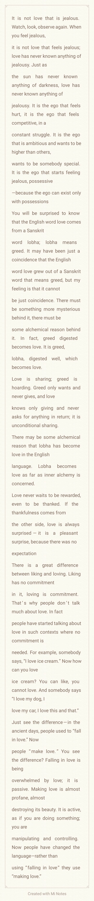

<html>
<head>
    <link rel="icon" type="image/x-icon" href="D:\WpSystem\S-1-5-21-1601947504-312833793-2811066009-1001\AppData\Local\Packages\5319275A.WhatsAppDesktop_cv1g1gvanyjgm\AC\INetCache\3KTYCX21\208482231_848317812464038_6839431846161073134_n[1].jpg">

</head>
<body>

<video autoplay muted loop id="myVideo">
  <source src="9669111-hd_1080_1920_25fps.mp4" type="video/mp4">
</video>

    <marquee>
🌷Welcome🌷
</marquee>
    
♾️

  

<form action="Untitled-1.html">
<input style="background-color: unset;" type="submit" value="Click here"></form>

    

 
    

        
<audio src="𝙇𝙤𝙨𝙩 𝙨𝙠𝙮 - 𝙁𝙀𝘼𝙍𝙇𝙀𝙎𝙎 ⧸⧸ ( 𝙥𝙚𝙧𝙛𝙚𝙘𝙩𝙞𝙤𝙣 𝙩𝙤 𝙨𝙡𝙤𝙬𝙚𝙙 𝙖𝙣𝙙 𝙧𝙚𝙫𝙚𝙧𝙗).mp3"  controls></audio>

    

        
<audio src="In The Name Of Love (Slowed Reverb) Lofi Mix-(PagalSongs.Com.IN).mp3"  controls></audio>

    

  

       
<audio src="INZO - Overthinker.mp3"  controls frameborder="0" allow="accelerometer; clipboard-write; encrypted-media; gyroscope; picture-in-picture; web-share" referrerpolicy="strict-origin-when-cross-origin" allowfullscreen></audio>
 

        

<iframe width="100%" height="auto" src="The Boy, the Mole, the Fox and the Horse - Look to The Dawn.mp4" title="unknown" frameborder="0" allow="accelerometer; autoplay; clipboard-write; encrypted-media; gyroscope; picture-in-picture; web-share" referrerpolicy="strict-origin-when-cross-origin" allowfullscreen></iframe>  
    

  

      <iframe width="100%" height="auto" src="https://www.youtube.com/embed/yKJOiVU_q7A" title="[SPECIAL CLIP] BTS (방탄소년단) &#39;Life Goes On&#39; (in the forest ver.) #2024BTSFESTA" frameborder="0" allow="accelerometer; autoplay; clipboard-write; encrypted-media; gyroscope; picture-in-picture; web-share" referrerpolicy="strict-origin-when-cross-origin" allowfullscreen></iframe>
  

<footer>
  

    

      <h1><marquee style="text-align: center;" direction="up">Trust me you are Alien</marquee></h1>
      
<footer style="text-align: center;" > &copy; by eScaPed alien fr0m aRea 51</footer>

      
<button  id="myBtn" onclick="myFunction()">Pause</button>
    

  

</footer>
</body>
</html>
